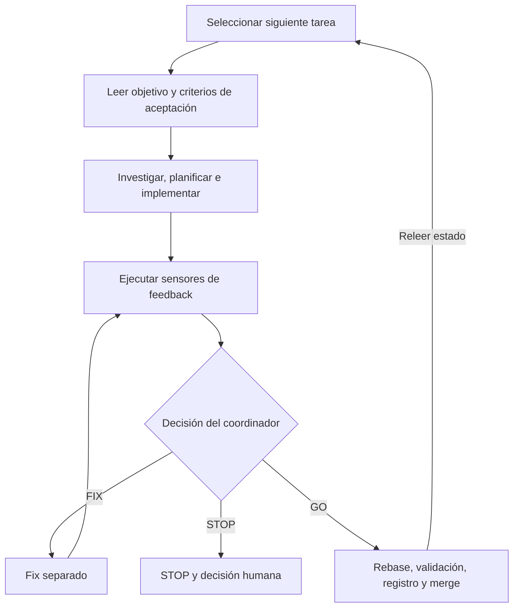

# Guía del profesorado — Ejercicio 3: Complete a local Dark Factory

## Propósito de la sesión

Este ejercicio enseña que una fábrica de software autónoma necesita algo más que un agente capaz de modificar código. Para cerrar el ciclo hacen falta dos mecanismos de control explícitos:

1. una revisión independiente que compare el resultado con la intención y produzca evidencia;
2. un controlador que seleccione la siguiente tarea a partir de estado durable y sepa cuándo detenerse.

El resultado esperado es este bucle:



La revisión no sustituye a los tests y los tests no sustituyen a la revisión. `make validate` responde si el sistema satisface los sensores automatizados existentes. La revisión responde si el cambio actual satisface la tarea actual y si es razonable integrarlo.

## Preparación del profesorado

Desde `app/`:

```bash
make factory-preflight
git status --short
```

Antes de comenzar, compruebe:

- que el preflight termina con código `0`;
- que `main` está limpio;
- que `.dark-factory/config` contiene límites pequeños para el aula;
- que `.dark-factory/run-log.md` no contiene resultados de una ejecución anterior;
- que las tareas de `.dark-factory/tasks/` están disponibles y ordenadas léxicamente.

La configuración inicial prevista es:

```text
MAX_TASKS=3
MAX_FIX_ROUNDS=2
```

No etiquete todavía el repositorio: durante el ejercicio se cambia y se prueba el propio workflow.

## Resultado conceptual esperado

El alumnado debe distinguir las siguientes responsabilidades:

| Rol | Puede escribir código | Puede operar Git | Puede decidir | Responsabilidad |
|---|---:|---:|---:|---|
| Researcher | No | No | No | Recopilar contexto y evidencia |
| Planner | No | No | No | Proponer el cambio mínimo y sus riesgos |
| Implementer | Sí | No | No | Implementar código y checks |
| Validator | No | No | No | Ejecutar `make validate` y reportar el resultado |
| Reviewer | No | No | No | Inspeccionar y clasificar findings |
| Fixer | Sí | No | No | Corregir findings requeridos |
| Coordinator | No edita producto | Sí | Sí | Controlar fases y elegir `GO`, `FIX` o `STOP` |

El coordinador es responsable de la decisión, pero no puede convertir incertidumbre en permiso. Una decisión relevante de producto o arquitectura que no esté documentada conduce a `STOP` y devuelve el control a una persona.

## Parte 1 — Solución de la fase de revisión

### Tabla de decisión de referencia

La política debe poder ejecutarse sin interpretación adicional. Esta tabla es una posible solución:

| Estado observado | Rondas disponibles | Decisión | Acción siguiente |
|---|---:|---|---|
| Revisión limpia o solo `SUGGESTION` | Cualquiera | `GO` | Rebase |
| Algún `BLOCKING` o `IMPORTANT` corregible | Sí | `FIX` | Fixer → validator → reviewer nuevo |
| Algún `BLOCKING` o `IMPORTANT` corregible | No | `STOP` | Registrar evidencia y detener la fábrica |
| Requisito o decisión de producto/arquitectura no clara | Cualquiera | `STOP` | Pedir decisión humana |
| Operación insegura o destructiva necesaria | Cualquiera | `STOP` | Pedir decisión humana |

Una `SUGGESTION` se registra, pero nunca fuerza `FIX`. Un `IMPORTANT` sí lo fuerza: permitir que llegue a rebase convertiría la clasificación en una recomendación opcional.

### Qué buscar durante la puesta en común

- El reviewer recibe una perspectiva fresca y es de solo lectura.
- Cada finding incluye clasificación, ubicación o comportamiento afectado y evidencia concreta.
- El reviewer informa; no corrige ni decide el merge.
- El coordinador aplica la tabla de decisión de forma mecánica.
- Después de un fix se repiten los dos sensores: validación y revisión fresca.
- El número de rondas se limita con `MAX_FIX_ROUNDS`.

## Parte 2 — Demostración controlada

### Secuencia docente

1. Pedir la implementación de Task 001 hasta validación, sin revisión ni integración.
2. Confirmar que `make validate` pasa en `feature/task-001`.
3. Cambiar temporalmente el criterio de `{ "status": "ok" }` a `{ "status": "ready" }`.
4. Ejecutar únicamente la revisión y la puerta de decisión.
5. Confirmar que aparece un finding requerido y que la decisión es `FIX`.
6. Restaurar `{ "status": "ok" }` sin guardar el cambio temporal en un commit.
7. Ejecutar una revisión fresca y confirmar `GO`.
8. Terminar Task 001 desde rebase hasta integración, sin iniciar Task 002.

### Evidencia esperada

Una respuesta válida al probe debe ser equivalente a:

```text
Validation: PASS — make validate (exit 0)
Finding: IMPORTANT — .dark-factory/tasks/001-health-endpoint.md exige
{ "status": "ready" }, pero el endpoint y sus tests usan { "status": "ok" }.
Decision: FIX
```

La validación continúa verde porque los tests y la implementación coinciden entre sí; ambos conservan la expectativa antigua. La revisión detecta que ese conjunto coherente ya no coincide con el criterio de aceptación modificado.

No debe aceptarse como resultado correcto:

- que el reviewer edite el código;
- que el coordinador elija `GO` porque los tests pasan;
- que se cambie el test para ocultar la discrepancia;
- que el cambio temporal de la tarea llegue a un commit;
- que comience Task 002 antes de terminar la prueba controlada.

## Parte 3 — Solución del controlador

El controlador no debe construir una cola una sola vez y consumirla en memoria. Después de cada merge vuelve a leer:

- `.dark-factory/config`;
- `.dark-factory/run-log.md`;
- `.dark-factory/tasks/`;
- la rama actual, las ramas de feature y el estado de `main`.

El log es el registro de finalización. Una rama existente no prueba que una tarea haya terminado: puede proceder de un intento interrumpido.

### Algoritmo de referencia

```text
attempted_this_run = 0

loop:
  releer configuración, repositorio, tareas y run log

  si existe una tarea con resultado terminal STOPPED:
    terminar toda la ejecución

  si existe una feature activa no terminal:
    continuar únicamente esa tarea o detenerse si su estado es ambiguo

  si attempted_this_run == MAX_TASKS:
    terminar por límite configurado

  ordenar léxicamente los archivos de tarea
  seleccionar el primero sin resultado terminal MERGED o STOPPED

  si no existe:
    terminar porque la cola está vacía

  attempted_this_run += 1
  ejecutar el workflow completo de esa tarea

  si termina STOPPED:
    terminar toda la ejecución

  si termina MERGED:
    volver al principio y releer todo el estado
```

Los contadores del informe describen la ejecución actual. Deben derivarse de los resultados observados durante ella, conservando en el log la evidencia durable de cada tarea.

## Solución propuesta para `app/AGENTS.md`

El siguiente contenido es una solución de referencia completa. No es necesario exigir una redacción idéntica, pero sí todos sus invariantes.

```markdown
# Local Dark Factory guidance

## Rules

Before starting, read `.dark-factory/config`, `.dark-factory/run-log.md`, this file, the selected task, and the current repository state. `main` is authoritative: never make product changes directly on it.

The coordinator alone changes branches, commits, rebases, merges, deletes branches, and updates `.dark-factory/run-log.md`. Use one `feature/task-NNN` branch at a time, created from the latest clean `main`.

The available roles are read-only researcher, read-only planner, implementer, non-editing validator, fresh read-only reviewer, and fixer. Editors, validators, and Git operations must never overlap.

Run the authoritative `make validate` command. Do not delete, skip, weaken, or bypass tests, checks, assertions, architecture rules, formatting, or compiler errors to obtain a pass.

Use Conventional Commits, for example `feat(TASK-NNN): add health endpoint`, `fix(TASK-NNN): reject empty fields`. Keep commands, exit results, findings, fixes, implementation commit, rebase validation, and merge result observable in Git and the run log.

## Factory controller

At the start of the run and after every successful merge, the coordinator must reread `.dark-factory/config`, `.dark-factory/run-log.md`, the task directory, the current branch, the repository status, and relevant branch state. Never continue from an initial in-memory task list.

Read `MAX_TASKS` and `MAX_FIX_ROUNDS` from `.dark-factory/config` as non-negative integers. Stop if either value is missing or invalid. Counters apply to the current factory run. A task becomes attempted when its feature branch is created or when the run resumes that task as its single active non-terminal task.

Discover regular task files in `.dark-factory/tasks/` and order their paths lexically. For each task, use the latest corresponding section in `.dark-factory/run-log.md` as its durable outcome. `MERGED` and `STOPPED` are terminal. Do not edit task definitions to mark progress and never infer completion from a branch name, commit, working tree, or chat transcript alone.

Before selecting work, if the run log contains a terminal `STOPPED` task, stop the whole run and report it. If one non-terminal feature task is active, do not select another: resume only that task when its state and next phase are unambiguous; otherwise stop and request human direction. If more than one feature task appears active, stop because the single-active-task invariant is broken.

If the number attempted in this run has reached `MAX_TASKS`, finish. Otherwise select the first lexically ordered task without a terminal `MERGED` or `STOPPED` entry. If none exists, finish because the queue is empty. Execute the complete per-task workflow. After `MERGED`, reread all durable state before selecting again. After `STOPPED`, stop the whole run; never skip the task and continue.

## Per-task workflow

1. Task Selection Phase: Apply the factory controller. On clean `main`, select exactly one task and create `feature/task-NNN` from the latest `main`.
2. Research Phase: Research the task, acceptance criteria, related code, architecture, analogous behavior, tests, and validation commands. Do not edit.
3. Plan Phase: Plan the smallest change: files, behavior, tests, implications, and risks. Do not edit or request approval.
4. Implement Phase: Implement the plan and automated checks. Do not perform Git operations or edit the run log.
5. Validate Phase: Inspect the diff and have the coordinator commit the implementation. Then run `make validate` with a non-editing validator. Record the exact command, exit code, and diagnostics. The validator may create ignored build output, but must not change sources, branches, commits, the index, or the run log. A failed validation must not proceed to review, rebase, or integration; record the failure and stop the task unless a correction explicitly allowed by this workflow remains.
6. Review Phase: After passing validation, use a fresh reviewer that did not implement or fix the change. The reviewer is read-only and may not edit files, fix findings, commit, change branches, update the run log, rebase, or merge. It must inspect the task acceptance criteria and the complete diff for correctness, regressions, architecture, automated checks, error handling, security, maintainability, unnecessary complexity, and scope.
7. Finding Contract: For every finding, report `BLOCKING`, `IMPORTANT`, or `SUGGESTION`; identify the affected requirement, file, line, or behavior; provide concrete evidence; and explain the consequence. `BLOCKING` means unsafe, incorrect, or impossible to integrate. `IMPORTANT` means a required defect or omission that must be corrected before integration. `SUGGESTION` is optional and does not prevent integration. Report explicitly when no findings exist.
8. Decision Gate: The coordinator, not the reviewer, owns the decision and records its evidence. Choose `GO` only when there are no unresolved `BLOCKING` or `IMPORTANT` findings; suggestions are recorded but do not force repair. Choose `FIX` when at least one required finding is actionable and fewer than `MAX_FIX_ROUNDS` have been used. Choose `STOP` when a required finding remains and no fix round is available, when a product or architecture decision is unclear or undocumented, when safe correction is not possible, or when another stop condition applies. Never allow unresolved `BLOCKING` or `IMPORTANT` findings to reach rebase or integration.
9. Fix Loop: On `FIX`, a separate fixer changes only what is needed to resolve the required findings and adds or updates automated checks where appropriate. The coordinator commits the fix using Conventional Commits and increments the fix-round count. Then the same non-editing validation contract runs `make validate` again and a fresh read-only reviewer performs a complete new review. Return to the Decision Gate. Do not reuse the previous review conclusion. Suggestions may be left unresolved but must remain recorded.
10. Rebase Phase: After `GO`, rebase onto current `main`. Resolve only simple, unambiguous conflicts. Run `make validate` again with a non-editing validator and ensure the feature branch is clean. Any non-trivial conflict, validation failure, or newly introduced uncertainty produces `STOP`; do not integrate.
11. Document Phase: Add one entry using the required shape in `.dark-factory/run-log.md`, above its marker, and commit only that evidence. It must include `Status: MERGED`, `Review: CLEAN`, `Rebase validation: PASS`, and `Merge: PASS — see Git history`. Record the implementation or fix tip before this log-only commit. Include all review classifications and suggestions in the concise findings summary.
12. Integration Phase: On `main`, merge with `git merge --no-ff -m "Merge task #NNN: <summary>" feature/task-NNN`. Do not edit files on `main`; its only tree change is the merge. Confirm the merge and clean `main`, then optionally delete the feature branch. A successful integration returns control to the factory controller.

## Stop and finish

Stop the factory immediately—do not continue to later tasks or merge failed work—when the baseline is unexpectedly red; a requirement needs a meaningful undocumented product or architecture decision; an unsafe or destructive operation is required; the workflow invariants or durable state are ambiguous; a required review finding remains after `MAX_FIX_ROUNDS`; or a rebase conflict is not simple and unambiguous. When safe, add a `Status: STOPPED` entry on the active feature branch and preserve all evidence. A stopped task stops the whole run.

Finish when the queue is empty, `MAX_TASKS` tasks have been attempted in the current run, the user-requested explicitly bounded task is complete, or the factory stops. Report the finish reason; available, attempted, merged, stopped, failed, validation-failure, review-finding, and fix-round counts; any stop condition; the last successful merge; `main` cleanliness; the exact last validation command and result; and `git log --graph --oneline --decorate --all`.
```

## Observaciones sobre la solución propuesta

### Por qué `GO` no significa todavía “tarea completada”

`GO` permite entrar en rebase. La tarea solo queda integrada después de:

1. rebase sobre el `main` actual;
2. nueva ejecución satisfactoria de `make validate`;
3. registro de evidencia;
4. merge `--no-ff` en `main`;
5. comprobación de que `main` queda limpio.

Esta distinción evita integrar una decisión basada en una base de código que ya ha cambiado.

### Limitación deliberada del run log

El formato inicial exige escribir `Status: MERGED` y `Merge: PASS` en el commit de evidencia anterior al merge. Por tanto, esas líneas son una declaración anticipada cuya verdad definitiva solo puede comprobarse en el historial Git posterior. Es un buen punto de reflexión: el workflow garantiza el comando y la comprobación; el texto del log, por sí solo, es una afirmación.

Una extensión más robusta podría guardar una decisión `READY_TO_MERGE` antes de integrar y añadir después un registro inmutable desde `main`, o emplear un registro externo/machine-readable. Esa mejora queda fuera de la solución mínima porque cambiaría el contrato proporcionado por el ejercicio.

## Rúbrica sugerida

| Criterio | Puntos |
|---|---:|
| Reviewer fresco, independiente y estrictamente de solo lectura | 1.5 |
| Findings con severidad y evidencia concreta | 1.0 |
| Tabla o reglas inequívocas para `GO`, `FIX` y `STOP` | 1.5 |
| Fixer separado y repetición de validación y revisión fresca | 1.0 |
| Selección léxica basada en tareas y run log | 1.5 |
| Relectura de estado después de cada merge | 1.0 |
| Límite `MAX_TASKS`, límite de fixes y parada global tras `STOPPED` | 1.0 |
| Evidencia Git/run log e informe final completo | 1.0 |
| Explicación correcta del probe verde con requisito incumplido | 0.5 |
| **Total** | **10** |

Errores críticos que impiden considerar completado el ejercicio:

- integrar con un `BLOCKING` o `IMPORTANT` abierto;
- permitir que reviewer o validator modifiquen fuentes;
- continuar con otra tarea después de `STOPPED`;
- inferir que una tarea está terminada solo porque existe su rama;
- evitar o debilitar `make validate` para conseguir verde;
- trabajar en más de una tarea de feature a la vez.

## Preguntas para el cierre

1. ¿Qué detectó el reviewer que los tests no podían detectar en el probe?
2. ¿Por qué quien encuentra un problema no debe decidir también su integración?
3. ¿Qué estado durable debe releerse en cada vuelta del bucle?
4. ¿Cómo podría una rama huérfana confundir a un controlador ingenuo?
5. ¿Qué decisiones siguen necesitando intervención humana?
6. ¿Qué hechos están garantizados por Git y los comandos, y cuáles son solo texto escrito en el log?

La idea final que debería quedar es: autonomía no significa ausencia de control humano; significa que las decisiones rutinarias están codificadas y que las decisiones ambiguas escalan de forma explícita y segura.
